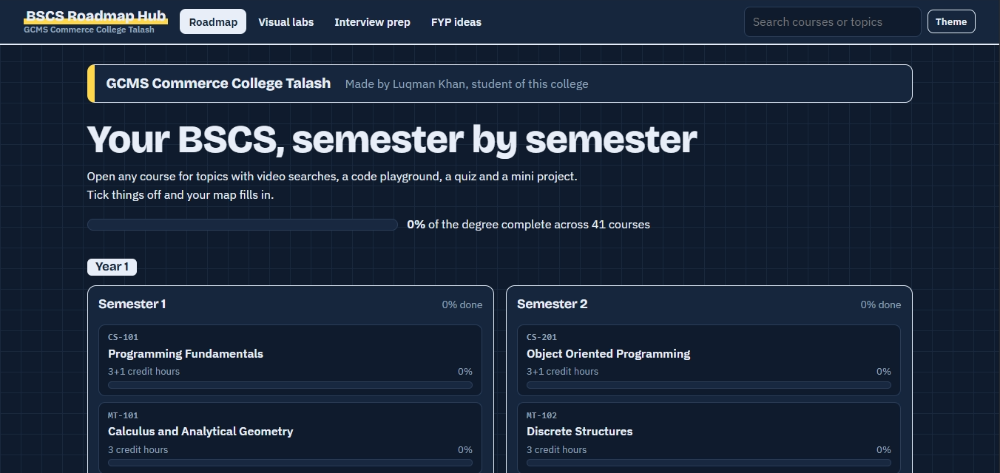

# BSCS Roadmap Hub

An interactive study guide for the full BSCS degree, built for computer science students.
It maps all 8 semesters and 41 courses, and every course has topics, practice, a quiz and a mini project.

Made by **Luqman Khan**, student of **GCMS Commerce College Talash**.

**Live demo:** https://luqmankhan10.github.io/bscs-roadmap-hub/

## Features

- **Degree roadmap:** Semester 1 to 8 with all courses, search, and a progress bar for every course and semester
- **Topics and videos:** a checklist per course with a "Watch video" button for each topic
- **Practice:** an in-browser code editor with runnable examples (JavaScript) for about 20 courses
- **Quizzes:** multiple choice questions with instant feedback for every course
- **Mini projects:** one project idea per course with steps to tick off
- **Visual labs:** sorting visualizer (bubble, selection, insertion, quick, merge), stack and queue, binary search
- **Interview prep:** flashcards for Data Structures, Algorithms, OS, Databases, Networks, OOP, AI and more
- **FYP ideas:** a generator that suggests Final Year Project ideas by area
- **Light and dark theme**, saved progress in the browser, and a responsive layout for phones

## Tech

Plain HTML, CSS and JavaScript in one file. No frameworks and no installation needed.
Progress is saved with `localStorage`.

## Run it

Download `index.html` and open it in any browser.

## Publish it on GitHub Pages

1. Create a new repository and upload `index.html` and `README.md`.
2. Go to **Settings > Pages**.
3. Under **Build and deployment**, choose **Deploy from a branch**, select the `main` branch and the `/ (root)` folder, then save.
4. After a minute your site is live at `https://YOUR-USERNAME.github.io/YOUR-REPO-NAME/`.

## Notes

The course list follows a typical 8-semester BSCS plan. Course names and order differ between universities.

## Ideas for the future

- Embedded lessons chosen for each topic
- Written notes for each topic
- More quiz questions per course
